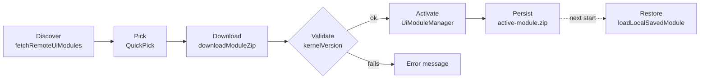

# How Modules Work in Catalyst UI

_As of 2026-09-26: catalyst 0.36.0, software-engineering module 2.0.0, catalyst UI 0.32.0._

A module is a versioned zip bundle for one process domain, built from its own
`catalyst-<module-id>` repository. The catalyst UI VS Code extension finds it
on cantica-tech, checks it against the **kernel** version, activates it, and
keeps a local copy. Only one UI module is active at a time.

## Terms

| Term           | Meaning                                                                                                                                                                                                                                               |
| -------------- | ----------------------------------------------------------------------------------------------------------------------------------------------------------------------------------------------------------------------------------------------------- |
| Framework      | The whole of catalyst: the kernel plus its process modules.                                                                                                                                                                                           |
| Kernel         | The part of the framework independent of modules, in `framework/kernel/` in the catalyst repo. Versioned by catalyst's root `version.txt`. Released as `kernel-v<version>.zip`.                                                                       |
| Process module | Entity types (ETDs), templates, slash commands and a grounding type, defined by `module.yaml` (`framework/kernel/MODULE-SPECIFICATION.md`). Used by agents and the kernel loaders (`scripts/module_loader.py`, `catalyst-core/src/module-loader.ts`). |
| UI module      | The same bundle zipped with a `manifest.json` plus React components under `ui/`. Used by the extension (`catalyst-core/src/ui-module-manager.ts`, `remote-module-store.ts`).                                                                          |

## Where modules live

Each module is a full repository of its own, checked out **next to** catalyst.
It is no longer a catalyst submodule: `framework/modules/software-engineering`
was removed in 0.35.0.

```
sources/
├── catalyst/                          # framework/kernel/ + framework/modules/sample-process only
├── catalyst-software-engineering/     # the module repo (origin: catalyst-software-engineering.git)
├── catalyst-ui/                       # the extension; the module's ui/ builds against it
└── cantica-tech/                      # published releases
```

The sibling layout is load-bearing. Three things look for a module there:

| Consumer                                      | Where it looks                                                                                                                           |
| --------------------------------------------- | ---------------------------------------------------------------------------------------------------------------------------------------- |
| `task release` (`scripts/package_release.py`) | `../catalyst-<id>/` for each module in `framework/modules/catalog.md`; skips any that is not checked out                                 |
| `scripts/module_loader.py`                    | `.criterion/modules/<id>`, then `framework/modules/<id>`, then `../catalyst-<id>/`; no built-in module, returns nothing if none is found |
| Module `ui/tsconfig.json`                     | `../../catalyst-ui/` for `catalyst-core` types (built `dist/index.d.ts`), `react` and `marked`                                           |

`.vscode/catalyst.code-workspace` opens all four folders together.

## Anatomy of a module repo

```
catalyst-software-engineering/
├── module.yaml                 # manifest: entity_types, commands, templates, definitions, required_paths, contributions
├── version.txt                 # module version (2.0.0), read by the release task
├── schemas/                    # one ETD per entity type: BUG, REQ, HK, TEST, STEP, FEAT, RM
├── templates/                  # <entity>.template.md, index and backlog templates
├── definitions/                # DEFINITION-<PREFIX>-vN.md per entity type
├── commands/                   # slash-command specs: create-req, create-bug, roadmap-add, ...
├── rules-of-rules.module.md    # module meta-rules, appended to the deployed Rules-of-Rules
├── code-of-conduct.module.md   # module document types and commands (CODE-OF-CONDUCT §3/§4)
├── INVARIANTS.module.md        # module invariants
├── Taskfile.module.yml         # one dispatch task per module command
├── migrations/                 # module migrations + migrations.md
├── ui/                # npm package @catalyst-modules/software-engineering-ui
│   ├── index.ts       # exports Backlog, RoadmapDetails
│   ├── Backlog.tsx
│   ├── RoadmapDetails.tsx
│   └── tsconfig.json  # outDir dist/
└── catalyst/modules/software-engineering/v<version>/   # release output, committed
    ├── manifest.json
    └── software-engineering-v<version>.zip
```

### The UI manifest (`manifest.json`)

The extension reads only this file. `parseUiModuleFromZip` checks the required
fields.

| Field              | Required | Example                               | Meaning                                                                                                                                                                                                        |
| ------------------ | -------- | ------------------------------------- | -------------------------------------------------------------------------------------------------------------------------------------------------------------------------------------------------------------- |
| `id`               | Yes      | `software-engineering`                | Unique id; also the folder name on cantica-tech                                                                                                                                                                |
| `name`             | Yes      | `Software Engineering Process Module` | Label in the module picker                                                                                                                                                                                     |
| `version`          | Yes      | `2.0.0`                               | Module version; release folder is `v<version>`                                                                                                                                                                 |
| `kernelVersion`    | Yes      | `>=0.36.0`                            | UV-style specifier the active kernel must satisfy.                                                                                                                                                             |
| `frameworkVersion` | Legacy   | `>=0.36.0`                            | Old name of `kernelVersion`, written with the same value. Extension builds before 0.31.0 read only this field. catalyst UI 0.31.0+ prefers `kernelVersion` and falls back to it (`readManifestKernelVersion`). |
| `description`      | No       |                                       | Picker detail line                                                                                                                                                                                             |
| `entry`            | No       | `ui/index.js`                         | Entry script for the UI code (declared, not executed yet)                                                                                                                                                      |
| `components`       | No       |                                       | Reserved                                                                                                                                                                                                       |

The loader looks for `manifest.json`, then `ui-module.json`, then `module.json`,
first at the zip root and then in any subfolder.

## Lifecycle in the extension



This is the "Catalyst: Switch Process UI Module…" path. "Load Zipped UI
Module…" skips discovery and download.

1. **Discover.** `fetchRemoteUiModules(catalyst.moduleSourceUrl)` defaults to
   `git@github.com:oliben67/cantica-tech.git/catalyst/`.
   `parseArtifactSourceLocation` accepts a Git SSH URL with a path, a GitHub
   tree URL, a `git+https://…#branch:path` URI, a raw.githubusercontent URL, or
   a local path. It derives `moduleSubpath` (`catalyst/modules`) and
   `kernelSubpath` (`catalyst/kernel`; a legacy `…/framework` path maps to
   `…/kernel`). It tries three strategies and stops at the first that finds
   modules:
   1. Local folder scan, for `/path` or `file://` sources.
   2. Git CLI: a shallow clone cached in `<os tmp>/catalyst-git-remotes/<sha256(url)[:12]>`, then a scan. Works for private repos over SSH.
   3. GitHub REST API: the recursive tree plus raw manifest fetches. For public repos when `git` is missing.

   A scan expects `<modules>/<id>/v<version>/manifest.json` next to a zip,
   preferring `<id>-v<version>.zip`. Manifests without `id`, `version` and a
   kernel specifier are ignored; duplicate `id@version` pairs are dropped.

2. **Pick and download.** One QuickPick row per module; `downloadModuleZip`
   reads local paths and fetches `http` URLs.
3. **Validate and activate.** `UiModuleManager.loadAndActivateZipModule(zip,
kernelVersion)` unzips in memory, checks the manifest, and tests the
   specifier with `satisfiesUvVersionSpecifier` (`>=`, `<=`, `>`, `<`, `==`,
   `!=`, `~=`, `*`, comma-separated clauses combined with AND). On success it
   deactivates the current module and stores the new one, all files included.
   The kernel version checked is, in order: the one set with "Load Specific
   Kernel Version in Memory…", else the first deployment's
   `.criterion/version.txt`, else `REQUIRED_KERNEL_VERSION`.
4. **Persist and restore.** The zip is saved as
   `<globalStorageUri>/active-module.zip` (one slot) and restored at startup.
   If a workspace folder has no catalyst pointer and no module is active, the
   picker opens automatically.

## Integration contract with catalyst UI

A module plugs in through its manifest, the kernel-version check, and the
host's commands and settings. Its UI code is shipped and held in memory, but
catalyst UI does not run it yet.

| Kind    | Id                             | What it does                                                                                   |
| ------- | ------------------------------ | ---------------------------------------------------------------------------------------------- |
| Command | `catalyst.switchUiModule`      | Discover, pick, download, activate, persist                                                    |
| Command | `catalyst.loadUiModule`        | Activate a local `.zip`, persist it, refresh the tree and panels                               |
| Command | `catalyst.selectKernelVersion` | Set the in-memory kernel version and activate a placeholder `software-engineering-ui` manifest |
| Setting | `catalyst.moduleSourceUrl`     | Where modules are listed (default `cantica-tech.git/catalyst/`)                                |
| Setting | `catalyst.kernelSourceUrl`     | Where kernel releases are listed (default `cantica-tech.git/catalyst/kernel/`)                 |

On the kernel side, catalyst-core's `resolveModuleId` reads the `*.catalyst`
pointer's `module` field, then `.criterion/config.yaml` `module:` or
`.criterion/module.yaml` `id:`, and returns `undefined` when none is declared;
there is no default module. `loadModule` reads the module's own `module.yaml`
and ETD schemas from the deployment's `modules/<id>/` (or a sibling
`catalyst-<id>/` checkout). Since catalyst 0.36.0 the kernel itself names no
module: reconciliation (`RECON-`) and workflows (`WORKFLOW-`) are kernel
entities, and everything else comes from the module (MODULE-SPECIFICATION §6).

**Rendering.** A compile-time link (the module's `ui/` as an npm workspace of
catalyst UI, `eff7eb8`) was tried and reverted in `0616dbc`. It tied catalyst
UI's build to one module and ruled out switching at runtime. `Backlog` and
`RoadmapDetails` therefore exist twice: live in `catalyst-ui/src`, and shipped
but not rendered in the module's `ui/`. The missing piece is a runtime hook in
the webview that loads `manifest.entry` from `ActiveUiModule.files`.

## Build, packaging and release

`task release` in catalyst runs `scripts/package_release.py`:

1. **Modules.** For each module in catalyst's `framework/modules/catalog.md`
   checked out as `../catalyst-<id>/`, it writes
   `manifest.json` (`kernelVersion` and legacy `frameworkVersion`, both
   `">=<kernel version>"`, and `entry: "ui/index.js"`) and zips the repo into
   `catalyst/modules/<id>/v<version>/`. It skips dotfiles,
   `node_modules`, `dist` and `catalyst/`, then commits and pushes to the
   module repo's `main`.
2. **Kernel.** Zips `framework/kernel/` into
   `catalyst/kernel/v<version>/kernel-v<version>.zip` (manifest id
   `catalyst-kernel`).
3. **Deploy.** Copies both release folders into `../cantica-tech/`, regenerates
   its READMEs from the manifests, then commits and pushes to `main`.

```
cantica-tech/catalyst/
├── kernel/v0.34.0 … v0.44.0/{manifest.json, kernel-v<version>.zip}
└── modules/software-engineering/v1.0.0, v2.0.0, v2.3.0/{manifest.json, software-engineering-v<version>.zip}
```

| Date       | Release            | What it published                                                                                                                                                               |
| ---------- | ------------------ | ------------------------------------------------------------------------------------------------------------------------------------------------------------------------------- |
| 2026-09-30 | catalyst UI 0.33.2 | Extension paired with kernel `>=0.44.0`; deployment synced to kernel 0.44.0                                                                                                     |
| 2026-09-30 | catalyst 0.44.0    | `kernel-v0.44.0.zip`; four-eyes analysis of existing code (`ANALYSIS-`, `/run-analysis`), playbook deployed                                                                     |
| 2026-09-30 | catalyst 0.43.0    | `kernel-v0.43.0.zip`; `criterion create` without a URL                                                                                                                          |
| 2026-09-30 | catalyst 0.42.2    | `kernel-v0.42.2.zip`; reproducible release archives                                                                                                                             |
| 2026-09-29 | catalyst UI 0.33.1 | Extension paired with kernel `>=0.42.1`; deployment synced to kernel 0.42.1                                                                                                     |
| 2026-09-29 | catalyst 0.42.1    | `kernel-v0.42.1.zip`; module release archives always land on the module repo's `main`                                                                                           |
| 2026-09-29 | catalyst 0.42.0    | `kernel-v0.42.0.zip` (0.37.0–0.42.0: `.criterion`, the catalyst CLI, criterion on git, tiers, traced commits, changes made outside catalyst); software-engineering module 2.3.0 |
| 2026-09-28 | catalyst UI 0.33.0 | Extension resolving the working copy through `.criterion` (catalyst 0.37.0+); `.vsix` also kept in cantica-tech `catalyst/vsix/`                                                |
| 2026-09-26 | catalyst UI 0.32.0 | Extension with catalyst-core's module loader reading module.yaml (no built-in module)                                                                                           |
| 2026-09-26 | catalyst 0.36.0    | `kernel-v0.36.0.zip`; module-agnostic kernel; software-engineering module 2.0.0, requiring `>=0.36.0`                                                                           |
| 2026-09-25 | catalyst 0.35.2    | `kernel-v0.35.2.zip`; module 1.0.0 manifest with both fields, requiring `>=0.36.0`                                                                                              |
| 2026-09-25 | catalyst 0.35.1    | `kernel-v0.35.1.zip`; `/sync-kernel` withdrawn, `/sync-framework` kept                                                                                                          |
| 2026-09-25 | catalyst 0.35.0    | First kernel release; `catalyst/framework/` renamed `catalyst/kernel/` on cantica-tech                                                                                          |
| 2026-09-25 | catalyst UI 0.31.0 | Extension on the Marketplace with the kernel settings and commands                                                                                                              |

## Authoring a new module

- [ ] Create a `catalyst-<id>` repository and clone it next to catalyst. Don't add it as a submodule.
- [ ] Write `module.yaml` per `framework/kernel/MODULE-SPECIFICATION.md`, with ETDs, templates and command specs.
- [ ] Add `version.txt` and bump it on every release, or the new zip overwrites the old version folder.
- [ ] Put UI components in `ui/`, exported from `index.ts`, and build them before releasing.
- [ ] Generalize `scripts/package_release.py`: the module id, name and repo folder are hard-coded for software-engineering.
- [ ] Release, then check that "Switch Process UI Module…" lists the module and activates it on the target kernel version.

## Known pitfalls

| Pitfall                                         | Where                                                                                          | Effect                                                                                                                                                                                   |
| ----------------------------------------------- | ---------------------------------------------------------------------------------------------- | ---------------------------------------------------------------------------------------------------------------------------------------------------------------------------------------- |
| No compiled UI in the next release              | Module `ui/` builds to `dist/`, which the zip skips; `ui/*.js` is gitignored                   | `entry: ui/index.js` points at a file the zip won't contain. The old submodule checkout only shipped JS by accident, via stale local build files.                                        |
| Saved module restored against the wrong version | `activate()` passes `REQUIRED_KERNEL_VERSION` (`">=0.31.0"`, a specifier) as a version         | Read as 0.31.0, so a saved module needing `>=0.34.0` silently fails to restore on every start                                                                                            |
| Same fallback in the load commands              | `loadUiModule`, `switchUiModule`                                                               | A workspace with no deployment is checked as 0.31.0                                                                                                                                      |
| Build depends on sibling checkouts              | Module `ui/tsconfig.json` → `../../catalyst-ui`; types come from catalyst-core's built `dist/` | Build catalyst-ui first; the module won't compile outside the sibling layout                                                                                                             |
| Components duplicated                           | `catalyst-ui/src` vs the module's `ui/`                                                        | Fixes must land twice until runtime rendering exists                                                                                                                                     |
| Legacy release folder                           | Module repo still tracks `catalyst/module/` (singular)                                         | Dead copy of v1.0.0; discovery accepts both spellings                                                                                                                                    |
| Requirement follows the latest kernel           | `package_release.py` writes `>=<current kernel>`                                               | Re-releasing a module without bumping its version raises the requirement in place (v1.0.0 did this until 0.35.2); bump the module version on every release                               |
| Dropping `frameworkVersion` hides the module    | Manifest fields                                                                                | catalyst 0.35.0–0.35.1 published only `kernelVersion`, and extensions before 0.31.0 reported "No process UI modules found". Fixed in 0.35.2; keep writing both until old builds are gone |

## Open questions

- How should the webview load `manifest.entry`: as a bundled IIFE like `dist/webview.js`, or via dynamic `import()` from a webview URI?
- Should `kernelVersion` stay pinned to `>=<kernel version at release>`, or should module authors declare a fixed minimum (for example in `module.yaml`)?
